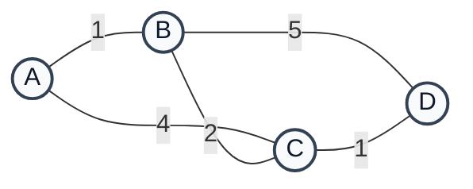
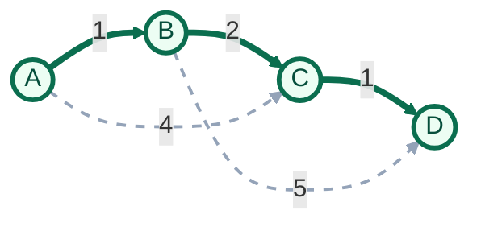
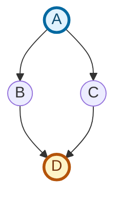

# 🕸️ graph-lab-py

A clean, Pythonic implementation of **weighted** and **unweighted** graph data structures. This repository serves as a foundational playground for learning graph theory and testing network algorithms.

## 🚀 Overview

This lab contains two core implementations:
- `unweighted_graph.py`: Basic node-edge connections where all paths have an equal cost.
- `weighted_graph.py`: Connections with assigned weights, representing distance, cost, or time.

## 📂 Project Structure

```text
graph-lab-py/
├── unweighted_graph.py  # Graph implementation (0 or 1 edge values)
├── weighted_graph.py    # Graph implementation (numerical edge weights)
├── tests/
│   └── test_graphs.py   # Smoke tests for shortest paths, MSTs, and cycles
└── README.md            # You are here!
```

## ✅ Run Tests

From the project root:

```bash
python3 -m unittest tests/test_graphs.py -v
```

This validates:
- weighted shortest paths (Dijkstra, Bellman-Ford)
- weighted MST (Prim, Kruskal)
- cycle detection for weighted/unweighted graphs
- edge cases like disconnected/unreachable inputs

## 🧪 Usage Examples

### Weighted Graph

```python
from weighted_graph import WGraph

g = WGraph({
	"A": [("B", 1), ("C", 4)],
	"B": [("A", 1), ("C", 2), ("D", 5)],
	"C": [("A", 4), ("B", 2), ("D", 1)],
	"D": [("B", 5), ("C", 1)],
})

print(g.dijkstra("A"))
print(g.bellman_ford("A"))
print(g.prim().graph)
print(g.kruskal().graph)
print(g.isCyclic())
```

### Unweighted Graph

```python
from unweighted_graph import UGraph

g = UGraph({
	"A": ["B", "C"],
	"B": ["D"],
	"C": ["D"],
	"D": [],
})

print(g.bestPath("A", "D"))
print(g.isCyclic())
```

## 📊 Visualizations

### Weighted Sample Graph



### Shortest Path from A to D (Cost = 4)



Shortest path result from `A` to `D`: `A -> B -> C -> D` with total cost `4`.

### MST (Prim/Kruskal Output)


### Unweighted Sample Graph



## Notes

- `dijkstra` raises an exception if any edge has a negative weight.
- `prim` raises an exception when the graph is disconnected.
- `bestPath` returns `[]` when no path exists or if a node is missing.
